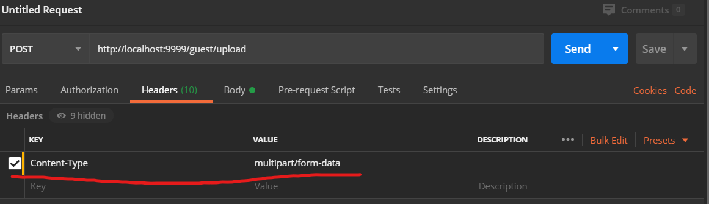
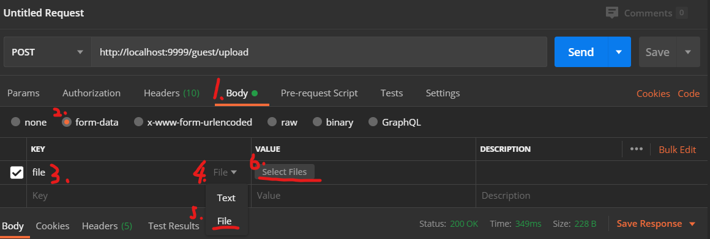

# 文件上传

## 利用MultipartFile

### 配置application.yaml

```yml
spring:
  servlet:
    multipart:
      # 上传文件总的最大值
      max-request-size: 10240MB
      # 单个文件最大值
      max-file-size: 1024MB
```

### 配置controller

```java
@RestController
@RequestMapping("/guest")
public class testController {
    
	@PostMapping("/upload")
    public ResultMap upload(@RequestParam("file")MultipartFile file){
        if(file.isEmpty()){
            return ResultMap.error().message("上传失败");
        }
        String fileName = file.getOriginalFilename();
        String filePath = "D://Videos/Upload/";
        File dest= new File(filePath+fileName);
        try{
            // transferTo非常方便
            file.transferTo(dest);
            return ResultMap.ok().message("上传成功");
        } catch (IOException e) {
            e.printStackTrace();
        }
        return ResultMap.error().message("上传失败");
    }
}
```

### 使用postman测试

设置Header



设置Body


